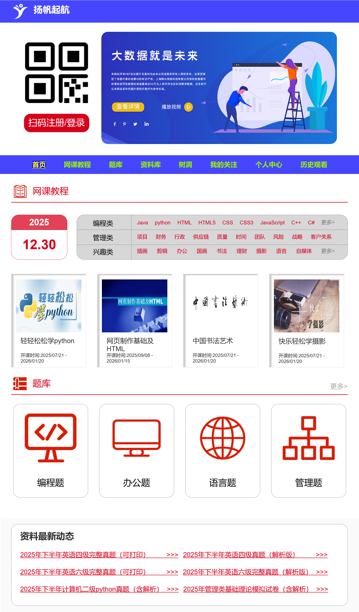
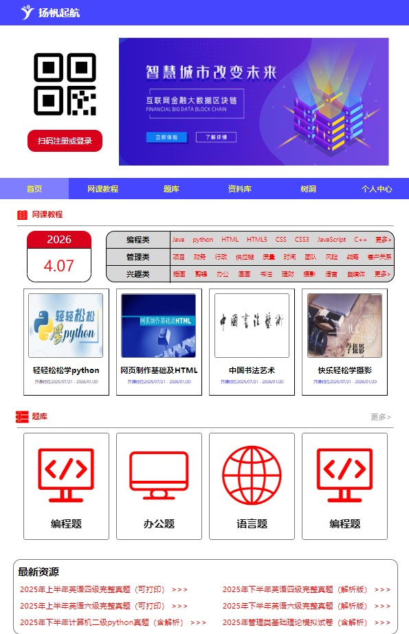
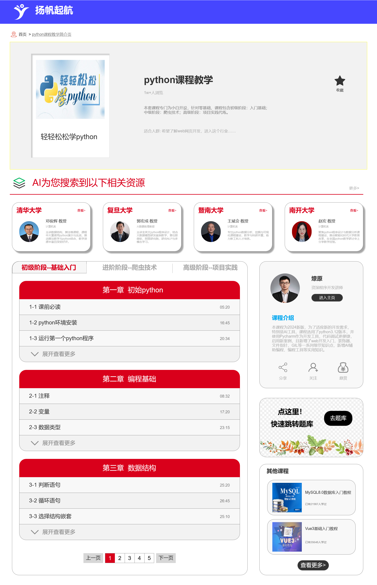
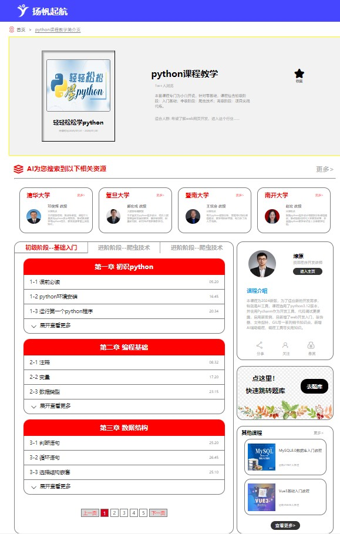
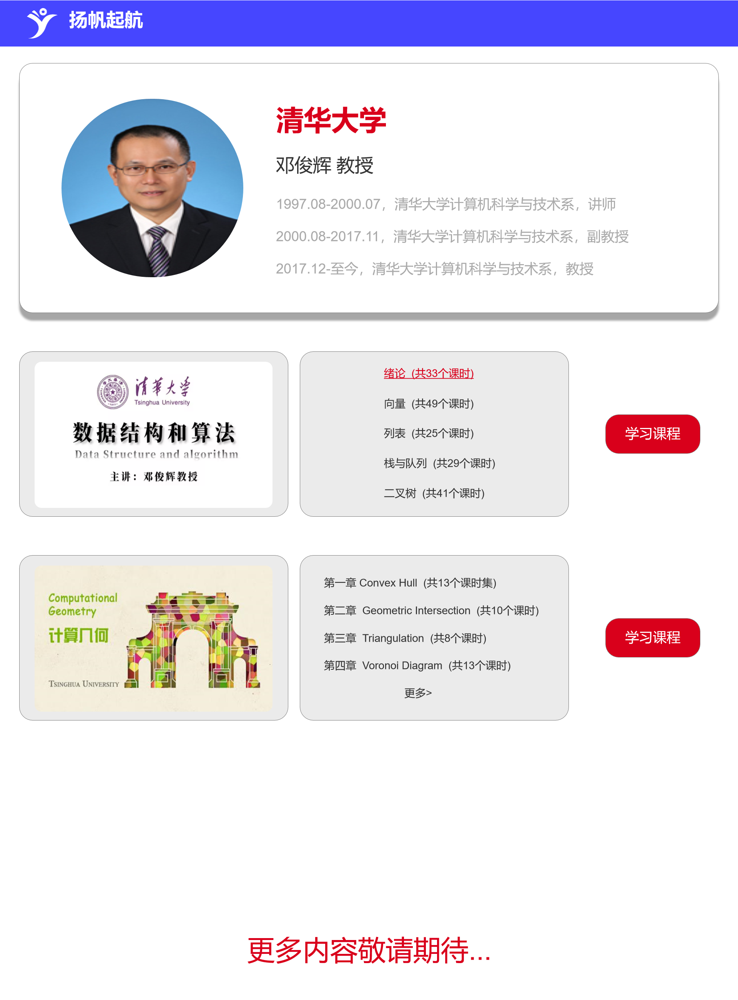

# 扬帆起航 - 在线学习平台前端项目

> 本项目是基于 Axure 高保真原型实现的响应式在线学习平台静态网站，已作为课程期末作业获评优秀。

---

## 📌 项目简介
本项目是一个面向在线学习场景的静态前端网站，完整还原了 Axure 高保真原型的视觉设计与交互逻辑，并在导航栏交互上进行了体验优化，新增二级菜单功能。项目支持多端响应式适配，可直接部署运行，具备完整的静态网站落地能力。

---

## 🛠️ 技术栈
- **核心语言**：HTML5、CSS3、JavaScript
- **布局方案**：Flex 弹性布局 + 盒子嵌套模式化开发
- **响应式适配**：`flexible.js + rem` 实现多端等比适配
- **原型工具**：Axure RP（高保真原型设计）
- **开发工具**：VS Code、Git

---

## ✨ 核心功能与亮点
1.  **1:1 高保真还原**
    基于 Axure 原型进行前端实现，完整还原了首页、课程页、个人介绍页等模块的视觉与交互效果，同时优化了导航栏交互，新增二级菜单功能。

2.  **响应式多端适配**
    使用 `flexible.js + rem` 方案，实现 PC 端、平板、移动端的等比自适应缩放，保证不同设备下的布局一致性与用户体验。

3.  **规范的模块化开发**
    采用 Flex 弹性布局搭建页面整体结构，通过盒子嵌套实现模式化开发，代码层次清晰，便于后续维护与扩展。

4.  **基础交互实现**
    包含首页轮播自动播放与暂停、课程列表展开/收起、分页导航等前端常见交互逻辑，实现了完整的静态网站交互闭环。

---

## 📸 项目展示
| 模块 | Axure 原型 | 前端实现效果 |
| :--- | :--- | :--- |
| 首页 |  |  |
| 课程页 |  |  |
| 介绍页 |  |  |

---

## 🚀 运行方式
1.  克隆仓库到本地
    ```bash
    git clone https://github.com/cyp2045/yangfan-qihang.git
    ```
2.  使用 VS Code 打开项目，通过 Live Server 运行 `首页.html`
3.  浏览器将自动打开项目预览，可正常查看所有页面与交互功能

---

## 📝 补充说明
- 项目为课程期末作业，已获评优秀，可直接部署运行
- 所有交互与样式均由原生 HTML/CSS/JavaScript 实现，未引入额外复杂框架
- 原型文件为个人设计，前端实现 100% 还原并优化了部分交互体验
- 由于本项目是盒子嵌套模式化开发，使用`flexible.js + rem`能更好地后续维护

---
